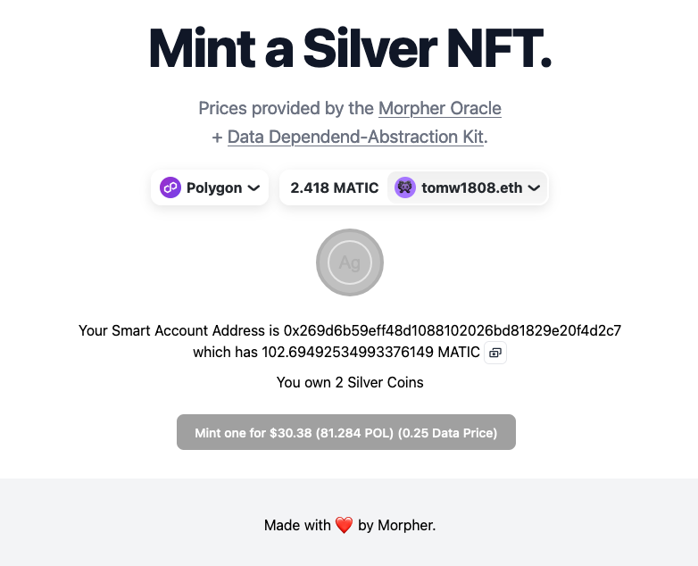

# Precious Metals Oracle Demo DApp

A decentralized application demonstrating real-time price feeds and data-dependent smart contract operations using the [Morpher Oracle](https://oracle.morpher.com) for precious metals markets.

## Overview



This DApp showcases the implementation of Data-Dependent User Operations in Web3, featuring:

- Real-time precious metal price feeds (XAG/USD, POL/USD)
- ERC4337 Account Abstraction
- NFT minting based on live market data
- Automated oracle price updates
- Smart contract interaction with verified price data

## Links & Resources

- [Technical Blog Post](https://ethereum-blockchain-developer.com/126-morpher-oracle/00-overview/)
- [Morpher Oracle Documentation](https://oracle.morpher.com)
- [Live Demo](https://morpher-oracle-silver-nft-demo.vercel.app/)
- [ERC4337 Account Abstraction Specification](https://eips.ethereum.org/EIPS/eip-4337)

## Tools & Technologies

- **Smart Contracts**: Solidity, ERC4337, ERC721
- **Frontend**: Next.js, React, TypeScript, Tailwind CSS
- **Web3 Integration**: wagmi, viem
- **Oracle**: Morpher Oracle for real-time price feeds
- **Development**: Foundry (Forge, Anvil, Cast)

## How It Works

1. Creates an ERC4337 Safe Wallet for secure transactions
2. Fetches real-time Silver (XAG/USD) and Polish Złoty (POL/USD) price data
3. Executes bundled ERC4337 transactions:
   - First UserOp: Updates oracle with latest price data
   - Second UserOp: Mints Silver NFT with current market prices

## Getting Started

```bash
# Install dependencies
npm install

# Run development server
npm run dev

# Deploy contracts
forge script script/DeployCoins.s.sol
```

## Contributing

Contributions are welcome!

## License

MIT License - see LICENSE file for details
